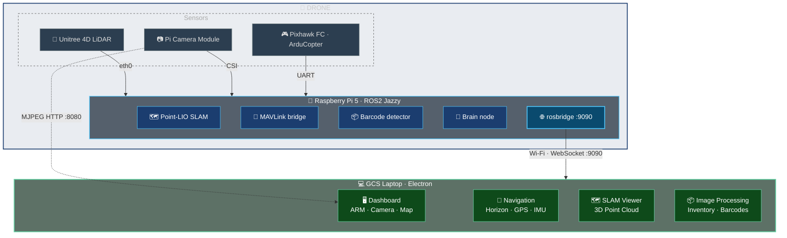

# PAE-EDISA 2026

> **Autonomous UAV system for warehouse inventory and 3D mapping** — built for EDISA as part of the UPC PAE programme (2025–2026).

A drone equipped with a LiDAR sensor, camera, and onboard computer flies autonomously through a warehouse, builds a real-time 3D map, detects barcodes and packages, and generates a geolocated inventory report — all without manual operation.

---

## Work Packages

| Folder | Work Package | Description |
|---|---|---|
| [`WP2/`](WP2/README.md) | **GCS & Drone Control** | Electron ground control app + ROS2 onboard stack + MAVLink bridge |
| [`WP3/`](WP3/README.md) | **Computer Vision** | Box detection, volumetry estimation, unified pipeline |
| [`WP1/`](WP1/planos_aruco/README.md) | **ArUco Localisation** | Marker-based pose estimation mockup |
| [`src/`](src/) | **SLAM Libraries** | Point-LIO and Unitree LiDAR ROS2 driver (submodules) |

---

## System Overview



---

## Key Results

- **Live 3D mapping** at 800,000 LiDAR points per scan using Point-LIO SLAM
- **Real-time barcode detection** with SLAM-tagged x/y/z position per scan
- **Autonomous waypoint navigation** driven by brain_node + Pixhawk MAVLink
- **Cross-platform desktop app** (Windows / Linux / macOS) — zero ROS needed on the laptop
- **SQLite inventory database** with CSV/Excel export

---

## Video Demo

<p align="center">
  <a href="WP2/gcs/docs/assets/demo.mp4">
    
  </a>
  <br/><em>▶ Click to watch the demo video</em>
</p>

---

## Screenshots

<p align="center">
  
  
</p>
<p align="center">
  
  
</p>

---

## Quick Start

```bash
# 1 — Deploy onboard software to the Raspberry Pi
scp WP2/gcs/raspberry/* raspi5@<PI_IP>:~/
ssh raspi5@<PI_IP> "pip3 install --break-system-packages flask opencv-python pyzbar pymavlink"
ssh raspi5@<PI_IP> "sudo systemctl enable --now rosbridge.service"

# 2 — Launch the GCS app (laptop)
cd WP2/gcs
npm install
npm start
```

---

## Tech Stack

**Onboard (Raspberry Pi 5):** ROS2 Jazzy · Point-LIO SLAM · pymavlink · picamera2 · OpenCV · pyzbar · Flask · rosbridge  
**Ground app:** Electron · Node.js · ROSLIB.js · Chart.js · Leaflet · SQLite3  
**Comms:** MAVLink v2 (UART) · rosbridge WebSocket · MJPEG HTTP  
**Vision:** YOLOv8 · OpenCV · pyzbar · ArUco

---

## Team

UPC — Universitat Politècnica de Catalunya  
PAE (Projecte d'Aplicació a l'Empresa) 2025–2026  
Client: EDISA

---

## Contributors

**Students**

Aaron Noguera · Aitor Pitarch · Alejandro de Alvarado · Alejandro Jové · Clara Jorba · Ignacio Blasi · Ignasi Fernández · Jaqueline Khalioulline · Lluís Estapé · Diego Rivas · Marc Elvira · Pablo Sánchez · Patricia Ballester · Samantha Wroblewski

**Professors**

Elisa Sayrol · Javier Ruiz-Hidalgo
