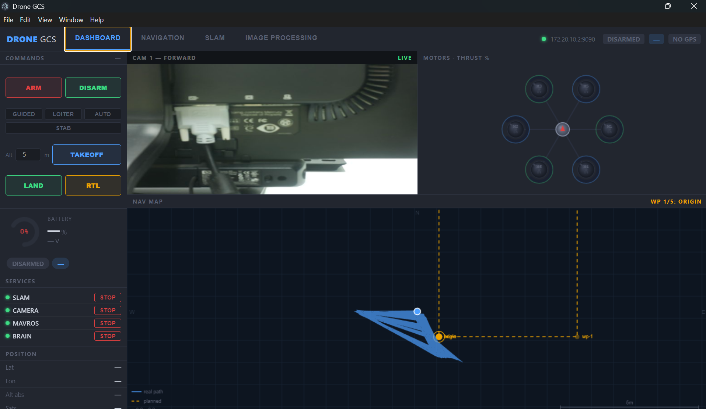
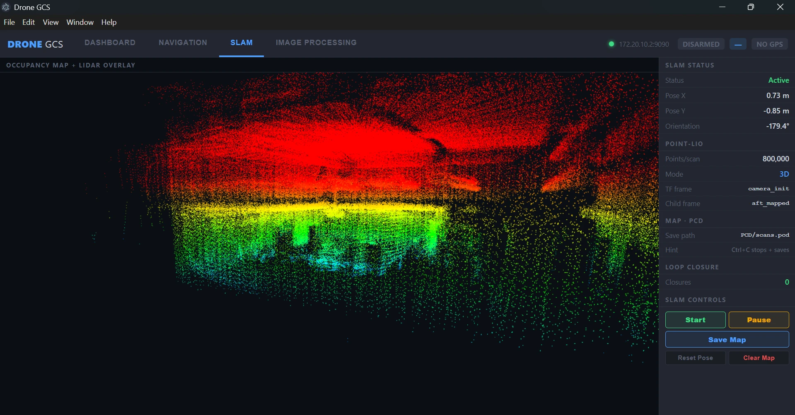
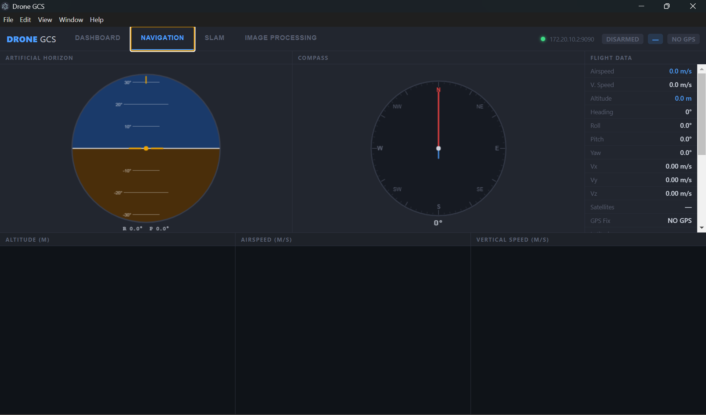
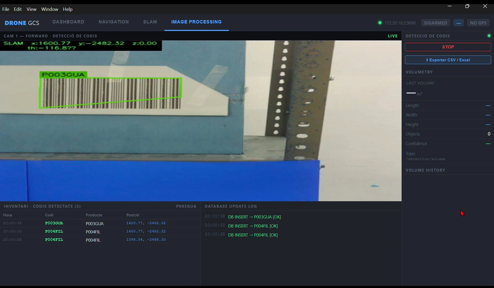

# Drone GCS — Autonomous Ground Control Station

> A full-stack UAV ground control system built on **Electron + ROS2**, running autonomously on a **Raspberry Pi 5** on board the drone and streaming all telemetry, video, and sensor data to a laptop over Wi-Fi in real time.

<p align="center">
  
  
</p>
<p align="center">
  
  
</p>

---

## What it does

The drone carries a **Raspberry Pi 5** running a full ROS2 stack. The Pi connects to:

- A **LiDAR sensor** (Unitree 4D) over Ethernet → builds a live 3D map
- A **camera** (Raspberry Pi Camera Module) → streams video and detects barcodes
- A **Pixhawk flight controller** over UART → reads telemetry and sends commands

All data is bridged to the ground laptop over Wi-Fi via **rosbridge WebSocket**. The laptop runs a native **Electron desktop app** that visualises everything in real time — no ROS installation needed on the laptop.

The system can autonomously fly a programmed waypoint route, scan a warehouse for barcodes, and produce a geolocated inventory report — all without a human operating the sticks.

---

## Tech Stack

| Layer | Technology |
|---|---|
| Ground app | Electron + Node.js, ROSLIB.js, Chart.js, Leaflet |
| Communication | rosbridge WebSocket (port 9090) |
| Onboard middleware | ROS2 Jazzy (Raspberry Pi 5) |
| 3D mapping | Point-LIO (tightly-coupled LiDAR-inertial SLAM) |
| Flight controller | ArduCopter via pymavlink (MAVLink v2, UART 57600) |
| Camera | picamera2 (ROS topic) + Flask MJPEG server |
| Vision | OpenCV + pyzbar (barcode/QR detection) |
| Storage | SQLite3 (inventory database) |
| Build target | Windows / Linux / macOS (Electron Builder) |

---

## Repository Structure

```
drone-gcs/
├── main.js              ← Electron main process (window, menu, IPC)
├── preload.js           ← Renderer ↔ main bridge (contextBridge)
├── renderer/            ← Frontend application (runs in the Electron window)
│   ├── index.html       ← UI shell (tabs, panels, styles)
│   ├── app.js           ← All application logic (ROS subscriptions, charts, map)
│   └── lib/roslib.js    ← ROSLIB.js (WebSocket ↔ ROS bridge client)
├── raspberry/           ← Onboard software (deployed to Raspberry Pi 5)
│   ├── gcs_control.py       ← ROS2 service manager (start/stop nodes on demand)
│   ├── camera_publisher.py  ← Pi Camera → /camera/forward/image_raw/compressed
│   ├── mjpeg_server.py      ← MJPEG HTTP server (Flask, port 8080)
│   ├── barcode_detector.py  ← Barcode/QR detection + SLAM overlay
│   ├── brain_node.py        ← Autonomous waypoint mission planner
│   ├── mavlink_bridge.py    ← MAVLink ↔ ROS2 bridge (replaces MAVROS)
│   ├── slam_launch.sh       ← LiDAR driver + Point-LIO SLAM launcher
│   ├── slam_params.yaml     ← Point-LIO tuning parameters
│   ├── start_all.sh         ← One-command full stack launcher
│   ├── rosbridge_boot.sh    ← rosbridge_server startup script
│   ├── rosbridge.service    ← systemd service (auto-start on boot)
│   └── drone-gcs.service    ← systemd service for gcs_control
└── docs/
    ├── Drone_GCS_Manual.pdf         ← Full technical manual
    ├── Drone_GCS_Presentation.pptx  ← Client presentation deck
    └── assets/                      ← Screenshots used in docs
```

---

## Application Modules

### 1 · Mission Control Dashboard
The entry point for every mission. Shows the live camera feed, NAV map with the drone's real-time SLAM position and planned waypoints, motor thrust visualisation, battery status, and a service panel to start/stop any component. ARM/DISARM and flight mode commands send directly to the flight controller via MAVLink.

### 2 · Navigation
Full flight telemetry display: animated artificial horizon (AHRS), compass rose, and live Chart.js graphs for altitude, airspeed, and vertical speed. All data arrives via MAVLink messages published as ROS topics by `mavlink_bridge.py`.

### 3 · LiDAR SLAM
Real-time 3D occupancy map rendered directly on an HTML Canvas element. The point cloud (up to 800,000 points/scan) is published by Point-LIO over the `/cloud_registered` topic and projected top-down with height colouring (red = high, blue = low). Pose X/Y/orientation, loop-closure count, and TF frames are displayed live. The map can be paused or saved to a `.pcd` file.

### 4 · Image Processing / Inventory Detection
The most operationally valuable module. The `barcode_detector.py` node subscribes to the Pi Camera ROS topic, runs pyzbar detection on every frame, stamps each detection with the current SLAM position (x, y, z), inserts a record into SQLite, and publishes the annotated frame back to the GCS. The result is a live inventory list with geolocated positions, exportable to CSV/Excel.

---

## System Architecture

```mermaid
flowchart TD
    subgraph DRONE["🚁  DRONE"]
        direction LR

        subgraph SENSORS["Sensors"]
            direction TB
            LiDAR["📡 Unitree 4D LiDAR"]
            CAM["📷 Pi Camera Module"]
            PX["🎮 Pixhawk FC · ArduCopter"]
        end

        subgraph PI["🍓  Raspberry Pi 5  ·  ROS2 Jazzy"]
            direction LR
            GCS_C["⚙️ gcs_control.py\nservice manager"]
            CAM_P["📷 camera_publisher.py\npicamera2"]
            MJPEG["🎥 mjpeg_server.py\nFlask :8080"]
            BAR["📦 barcode_detector.py\npyzbar + OpenCV"]
            MAV["🔌 mavlink_bridge.py\npymavlink"]
            BRAIN["🧠 brain_node.py\nmission planner"]
            SLAM["🗺️ slam_launch.sh\nPoint-LIO + Unitree"]
            RB["🌐 rosbridge_server\n:9090"]
        end

        LiDAR -- "Ethernet eth0" --> PI
        CAM   -- "CSI"           --> PI
        PX    -- "UART 57600"    --> PI
    end

    subgraph GCS["💻  GCS Laptop  ·  Electron"]
        direction LR
        DASH["🖥️ Dashboard\nARM · Camera · Map"]
        NAV["🧭 Navigation\nIMU · GPS · Charts"]
        SLAMV["🗺️ SLAM\n3D Point Cloud"]
        IMGP["📦 Image Processing\nInventory · Barcodes"]
    end

    RB    -- "Wi-Fi · WebSocket :9090" --> GCS
    MJPEG -. "MJPEG HTTP :8080" .->      DASH

    style DRONE  fill:#1B3D6F18,stroke:#1B3D6F,stroke-width:2px,color:#ccc
    style SENSORS fill:#ffffff08,stroke:#555,stroke-dasharray:4,color:#aaa
    style PI     fill:#0D1B2Aaa,stroke:#4FC3F7,stroke-width:1.5px,color:#fff
    style GCS    fill:#0D2A1Aaa,stroke:#64D2A4,stroke-width:2px,color:#fff
    style GCS_C  fill:#1B3D6F,stroke:#4FC3F7,color:#fff
    style CAM_P  fill:#1B3D6F,stroke:#4FC3F7,color:#fff
    style MJPEG  fill:#1B3D6F,stroke:#4FC3F7,color:#fff
    style BAR    fill:#1B3D6F,stroke:#4FC3F7,color:#fff
    style MAV    fill:#1B3D6F,stroke:#4FC3F7,color:#fff
    style BRAIN  fill:#1B3D6F,stroke:#4FC3F7,color:#fff
    style SLAM   fill:#1B3D6F,stroke:#4FC3F7,color:#fff
    style RB     fill:#0A4A6E,stroke:#4FC3F7,stroke-width:2px,color:#fff
    style DASH   fill:#0E4A1A,stroke:#64D2A4,color:#fff
    style NAV    fill:#0E4A1A,stroke:#64D2A4,color:#fff
    style SLAMV  fill:#0E4A1A,stroke:#64D2A4,color:#fff
    style IMGP   fill:#0E4A1A,stroke:#64D2A4,color:#fff
    style LiDAR  fill:#2C3E50,stroke:#7F8C8D,color:#ddd
    style CAM    fill:#2C3E50,stroke:#7F8C8D,color:#ddd
    style PX     fill:#2C3E50,stroke:#7F8C8D,color:#ddd
```



---

## Quick Start

### Deploy to Raspberry Pi

```bash
# Copy onboard software
scp raspberry/* raspi5@<PI_IP>:~/

# Install Python deps on the Pi
pip3 install --break-system-packages flask opencv-python pyzbar pymavlink

# Enable rosbridge auto-start
sudo cp ~/rosbridge.service /etc/systemd/system/
sudo systemctl enable --now rosbridge.service

# Launch the full stack
bash ~/start_all.sh
```

### Run the GCS app (laptop)

```bash
npm install
npm start              # development
npm run build          # build installer (Win/Linux/macOS)
```

Set the Pi's IP in the app connection bar: `ws://<PI_IP>:9090`

---

## Key Design Decisions

**Why not MAVROS?** MAVROS requires ROS on the same machine as the flight controller, adds heavy dependencies, and had serial detection issues on the RPi5 RP1 chip. A lightweight `pymavlink` bridge gives direct MAVLink access with zero extra ROS overhead and full control over reconnection logic.

**Why Electron?** The client app needs to run natively on Windows/Linux/macOS without requiring any ROS installation on the operator's machine. Electron + ROSLIB.js gives a full desktop UI that connects to any ROS2 robot over a standard WebSocket.

**Why Point-LIO over SLAM Toolbox?** Point-LIO is a tightly-coupled LiDAR-inertial odometry algorithm that works without a pre-built map and handles aggressive motion well — important for a flying platform. It publishes 800k-point scans at 4 Hz that are processed and displayed live in the GCS.

---

## Hardware

| Component | Model |
|---|---|
| Onboard computer | Raspberry Pi 5 — 8 GB |
| LiDAR | Unitree 4D LiDAR L1 |
| Camera | Raspberry Pi Camera Module 3 |
| Flight controller | Pixhawk (ArduCopter) |
| Frame | Custom quadcopter |
| GCS | Any Windows / Linux laptop |
